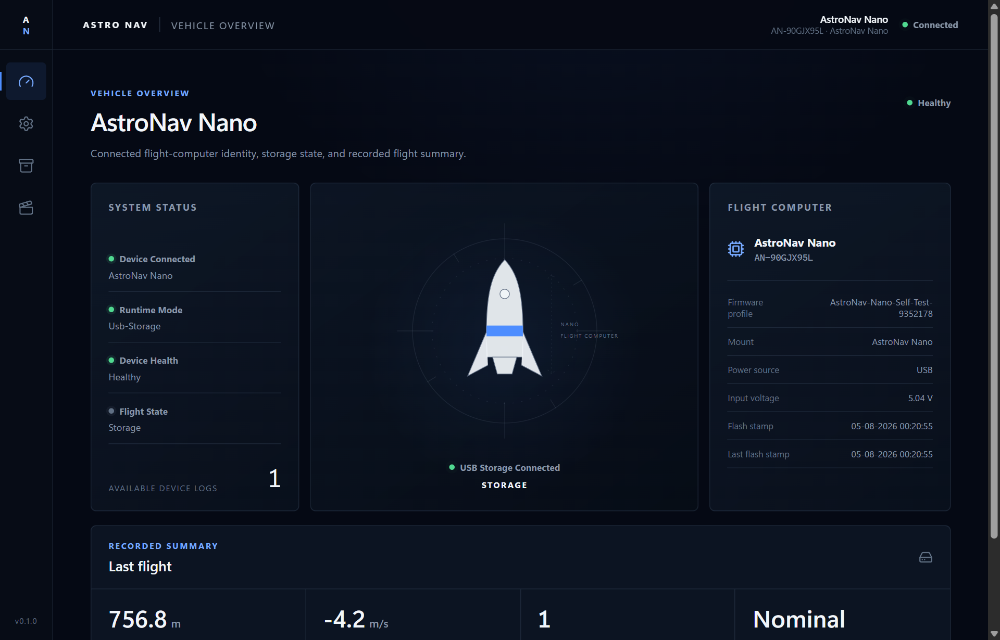

# AstroNav Mission Control

Stel je AstroNav Nano in, importeer vluchtlogs en speel je missies opnieuw af.

 <a href="README.md">English</a> &nbsp;|&nbsp;  <b>Nederlands</b>

 

  

AstroNav Mission Control (AstroNav MC) is de officiële Windows-desktopapplicatie voor de **AstroNav Nano**-flightcontroller van [YoupSpace](https://youpspace.com). Gebruik de app om je Nano in te stellen, vluchtlogs te importeren en je missies terug te kijken, volledig offline.

## Functies

<table>
  <tr>
    <td width="50%" valign="top"><h3>🔌 Automatische detectie</h3>Vindt je AstroNav Nano via USB, ook als er meer dan één is aangesloten, en toont identiteit, gezondheid en laatste vlucht.</td>
    <td width="50%" valign="top"><h3>⚙️ Veilig instellen</h3>Wijzig vluchtschatting en lanceerdetectie met validatie, een lokale herstelkopie en controle door terug te lezen.</td>
  </tr>
  <tr>
    <td width="50%" valign="top"><h3>📈 Missie terugkijken</h3>Speel vluchten af met gesynchroniseerde grafieken voor hoogte, snelheid, versnelling, rol/pitch, temperatuur en luchtdruk, plus een standweergave.</td>
    <td width="50%" valign="top"><h3>🎬 Video-overlay</h3>Zet je telemetrie over je lanceervideo en exporteer het resultaat als MP4.</td>
  </tr>
  <tr>
    <td width="50%" valign="top"><h3>🗂️ Offline archief</h3>Importeer vluchtlogs in een lokale bibliotheek die ook zonder apparaat beschikbaar blijft, en exporteer ze als CSV.</td>
    <td width="50%" valign="top"><h3>🔒 Privé</h3>Alles blijft op je computer. Het enige netwerkverzoek is de optionele updatecontrole.</td>
  </tr>
</table>

AstroNav MC werkt met een AstroNav Nano in USB-opslagmodus. Het is een bestandsgebaseerde tool. De app geeft geen live telemetrie en stuurt geen seriële commando's.

## Snel aan de slag

1. **Installeren.** Download het installatieprogramma (`*-setup.exe`) uit de [nieuwste release](https://github.com/YoupSpace/astronav-mc-releases/releases/latest) en voer het uit. Je hebt geen beheerdersrechten nodig.
2. **Aansluiten.** Voed je AstroNav Nano via USB en zet hem in USB-opslagmodus. AstroNav MC vindt hem automatisch.
3. **Vliegen en terugkijken.** Stel je Nano in onder **Settings** en open of importeer daarna je vluchtlogs onder **Flights** om de missie af te spelen.

De [handleiding van AstroNav MC](https://wiki.youpspace.com/software/astronav-mc/) beschrijft elk scherm in detail.

> [!WARNING]
> De AstroNav Nano kan ontstekings- en bergingshardware aansturen. Lees de [veiligheidsdocumentatie](https://wiki.youpspace.com/) voordat je een batterij, E-match of andere pyrohardware aansluit. Laat **Fire apogee pyro** uitgeschakeld, tenzij je bergingssysteem is aangesloten en voor die uitgang is ingesteld.

## Over YoupSpace

[YoupSpace](https://youpspace.com) is de plek van Youp voor projecten, producten en meer. YoupSpace bouwt en verkoopt hardwarekits, zoals de AstroNav-flightcontrollerkit, en deelt het bouwproces online. Het motto: *anything is possible, you decide your limits.*

AstroNav begon als modelraketproject om een raket te bouwen die 200+ meter hoog vliegt. Daaruit is de **[AstroNav Nano](https://youpspace.com/astronav-nano/)** ontstaan: een compacte flightcontroller en vluchtdatalogger voor modelraketten en vergelijkbare voertuigen. De Nano meet beweging en omgeving, herkent vluchtfasen, logt de missie en kan op het apogeum het bergingssysteem activeren als dat is ingeschakeld en ingesteld.

## Meer informatie

<b>Systeemvereisten</b>

- Windows 10 of 11 (64-bit)
- Microsoft Edge WebView2 (zit standaard in actuele Windows-versies)
- Een AstroNav Nano met USB-kabel, om het apparaat in te stellen of nieuwe logs te lezen. Geïmporteerde vluchten werken zonder apparaat.

<b>Updates</b>

AstroNav MC controleert deze repository op nieuwe versies en toont een melding als er een update is. Updates zijn ondertekend en worden vóór installatie gecontroleerd. Je kunt automatische updatecontroles uitzetten via **Settings → Application**.

<b>Privacy</b>

AstroNav MC doet geen netwerkverzoeken, behalve de optionele updatecontrole bij deze repository. Je vluchtlogs, instellingen en herstelkopieën worden alleen op je computer opgeslagen.

<b>Veelgestelde vragen</b>

**Mijn Nano wordt niet gevonden.**
Controleer of de Nano in USB-opslagmodus staat en of Windows hem heeft gekoppeld. De [probleemoplossing](https://wiki.youpspace.com/) beschrijft meer stappen.

**Kan ik AstroNav MC zonder Nano gebruiken?**
Ja. Vluchten die je eerder hebt geïmporteerd, blijven beschikbaar in de lokale bibliotheek.

**Toont AstroNav MC live telemetrie?**
Nee. AstroNav MC werkt met de bestanden die de Nano in USB-opslagmodus bewaart.

**Mag ik het installatieprogramma met een vriend delen?**
Deel de link naar deze pagina. De licentie staat het verspreiden van het installatieprogramma niet toe.

## Ondersteuning

Lees eerst de [probleemoplossing](https://wiki.youpspace.com/). Voor andere vragen mail je naar [youpspace@outlook.com](mailto:youpspace@outlook.com) of gebruik je de [supportpagina](https://youpspace.com/support/).

## Licentie

AstroNav Mission Control is gratis te gebruiken, maar het is **closed-source, propriëtaire software**. Je mag de app niet verspreiden, wijzigen of reverse-engineeren. Zie [LICENSE.nl](LICENSE.nl) ([English](LICENSE)). Bij verschillen geldt de Engelse versie.

 

[Website](https://youpspace.com) · [Wiki](https://wiki.youpspace.com/) · [Handleiding](https://wiki.youpspace.com/software/astronav-mc/) · [AstroNav Nano](https://youpspace.com/astronav-nano/) · [Shop](https://youpspace.com/shop/) · [Contact](https://youpspace.com/contact/)

Copyright © 2026 [YoupSpace](https://youpspace.com). Alle rechten voorbehouden.

